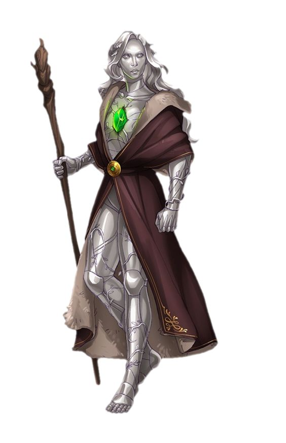

<InfoBox>

**Role** Researcher

**Home Island** [Skyhaven](/places/skyhaven)

**Ancestry** Android

</InfoBox>

# Atax
<Badge type="info" text="He/Him"/>

Atax is by all measures a rather ordinary android, he was found on a small island by a ship carrying an ore shipment bound for [Grefor](/places/grefor) 15 years ago and taken to Skyhaven. By his reconning after he learned the language he had been on the island for approximately a month before being picked up.

After acclimatising to Areodin society and picking his [name](/general/androids#names) Atax, like many other androids went on a tour of the world, and also like many others he became fascinated with science and history. Now a graduate of the [Academy](/places/academy) he has joined [Eletha](./eletha) aboard the Guiding Star.
