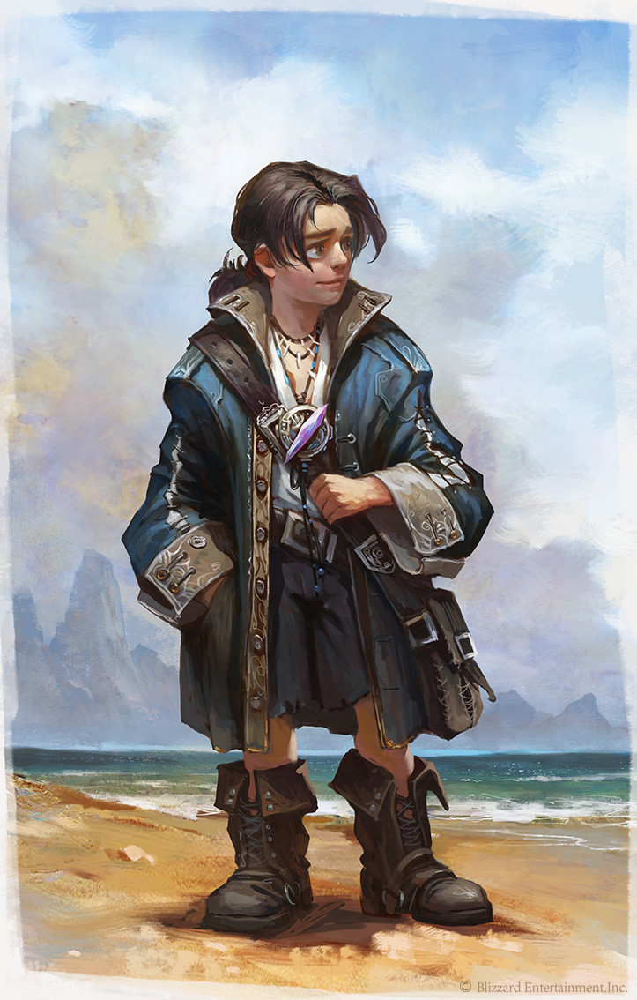

<InfoBox>
    

    
**Role** First Mate's Steward
    
**Birthplace** [The Iron Hearth](/places/mineral_holds)

</InfoBox>

# First Mate's Steward Ironhearth Brocard
<Badge type="info" text="He/Him"/>

Brocard is Ragnar's eternal shadow, rarely leaving his side. Unexpectedly for everyone, him included, the skittish halfling followed Ragnar into the military when he signed up; During his time there Brocard served as a support specialist and spotter on the field. Now as a part of the officer corps, he serves as secretary to Ragnar, running errands and messages for him. A timid but eternal workhorse Brocard will be essential to the operation of the ship and crew. 

<!--@include: ./brocard_ragnar.md-->
