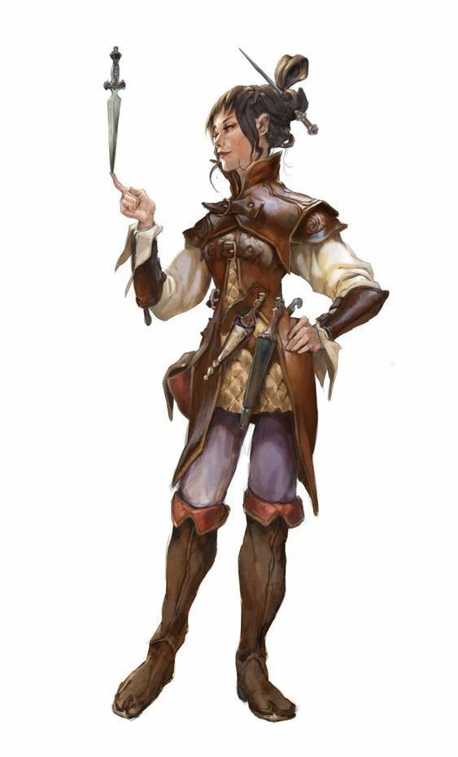

<InfoBox>
    

    
**Role** Topcrew
    
**Birthplace** [The Quintuplets](/places/quintuplets)

</InfoBox>

# Hurricane
<Badge type="info" text="She/Her"/>

Hurricane (why yes, she did name herself) was orphaned at a young age, and ever since she was old enough to understand that people pitied her for it she's resented it. She developed an unerring drive to be self-sufficient and capable and was, at least physically, a breeze to take care of. What so many years of seeing herself as a burden to be redeemed has done to her psyche though is yet to be determined. She's grown into a fiercely independent young athlete, fighter, and now topcrew. Feisty and quick to both anger and action she seems to have a bright future in the rigging.

<!--@include: ./trio_details.md-->
