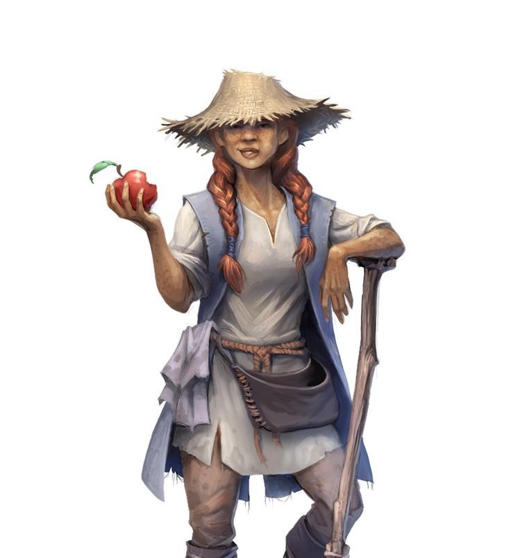

<InfoBox>

**Role** Cook's Assistant

**Birthplace** [The Quintuplets](/places/quintuplets)

**Ancestry** Human

</InfoBox>

# Pumpkin
<Badge type="info" text="She/Her"/>

Pumpkin was born to traditional farmers back in the Quintuplets and has worked the farm almost ever since she was old enough to walk. But as she grew older she wasn't very interested in the farming of food, but in the preparation of it. Years of labour have given her an impressive physique, rivalling people half her size again, and a healthy appetite and appreciation for food to match. Steadfast and stubborn, her apprenticeship in the galley and as a deckhand will most likely make her a favourite amongst the crew. 

<!--@include: ./trio_details.md-->
