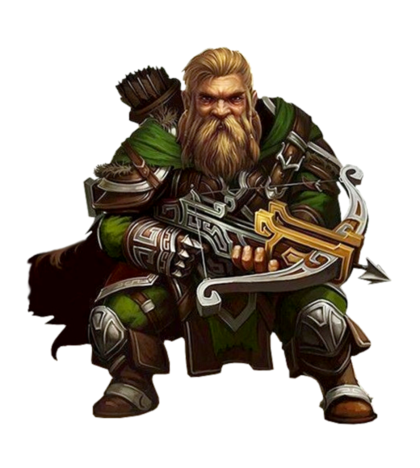

<InfoBox>
    

    
**Role** First Mate
    
**Birthplace** [The Iron Hearth](/places/mineral_holds)

**Ancestry** Dwarf

</InfoBox>

# First Mate Ironhearth Ragnar
<Badge type="info" text="He/Him"/>

Ragnar is a kind and gentle soul with unerring professionalism in the field. Born to iron harvesters in the Great Hold he found the routine of mineral harvesting stifling and boring. So he decided to take to the skies in search of adventures through the military. An expert crossbowman bar none his sharp eye and battlefield calm will be invaluable if the expedition meets danger, and his camaraderie with the crew will hold the ship together.

<!--@include: ./brocard_ragnar.md-->
