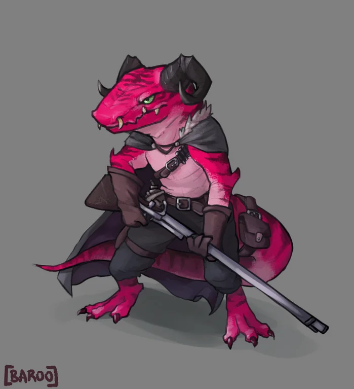

<InfoBox>

**Role** Gunnery Officer

**Birthplace** [Sky-Roost](/places/sky_roost)

**Ancestry** Kobold

</InfoBox>

# Gunnery Officer Ustraki
<Badge type="info" text="She/Her"/>

Ustraki, like most kobolds, has always had a fascination with flying, in her case only rivalled by her love of fire. So when someone on the Roost told her that there are people who work with firearms on airships she was off the island almost before they finished speaking.

In the years since she signed on Ustraki has acquired a reputation as one of the finest gunners in Areodin... as long as someone keeps her slightly wilder ideas in check. She's usually seen cleaning the firearms on the ship to a finer polish than the original gunsmiths, ferrying ammunition to battle stations, or trying some new method of destruction.
