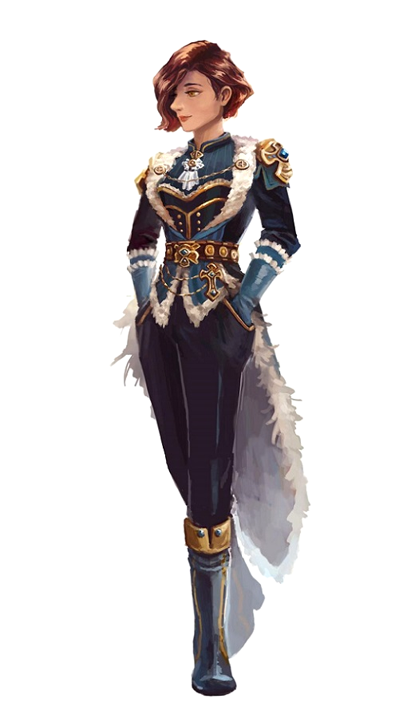

<InfoBox>
    

    
**Role** Captain
    
**Birthplace** [Skyhaven](/places/skyhaven)

**Ancestry** Half-Elf

</InfoBox>

# Captain Victoria Mosane
<Badge type="info" text="She/Her"/>

A veteran of the incursion of '63 where she led her ship and crew in downing an entire carrier themselves; Victoria has now retired to civilian life.

Born in Skyhaven to a family of wealthy merchants, she joined the navy at an early age to make a new for herself without her family. After leading one of the most successful navy careers in history she retired after her father died and spent some years in charge of several Mist-dives. After a recent dive she unexpectedly sold her share of the family business, bought one of the finest ships she could find, and started organising an archaeological expedition without much explanation.

She has a reputation for being a bit of a hard-ass in port but a softie in the skies. She tries to keep a very efficient crew, but not without compassion and flexibility, earning her respect from outsiders and love from her crew. 
